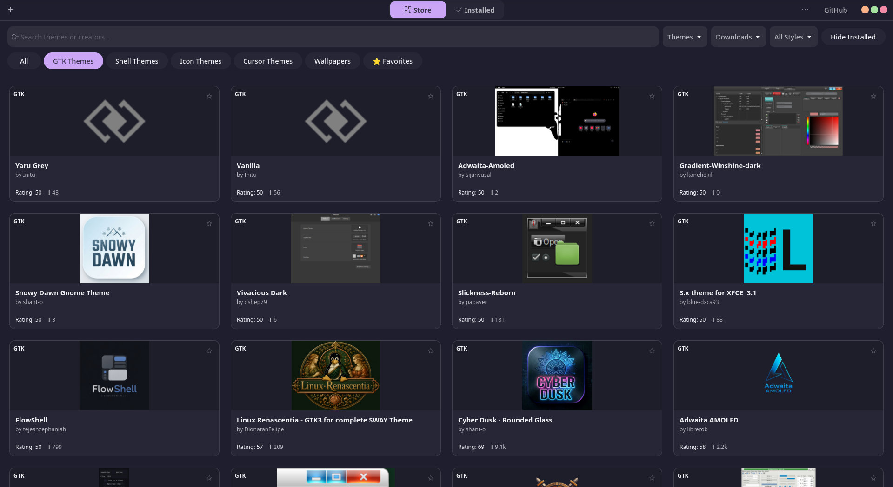
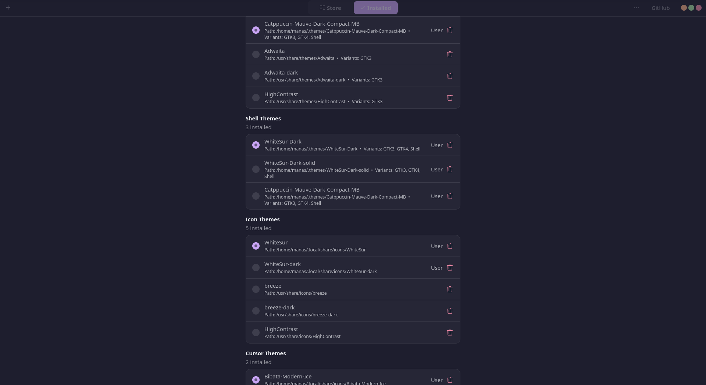
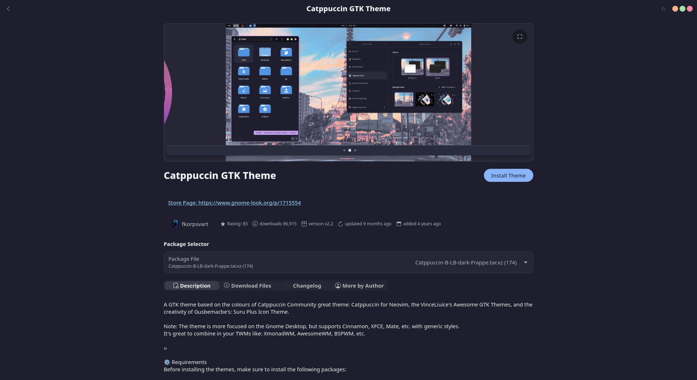

<p align="center">
  
  <h1 align="center">Motif</h1>
  <p align="center">Native GTK4 & Libadwaita Theme Manager for GNOME</p>
  <p align="center">
    <a href="https://github.com/manasdotio/motif/releases/latest"></a>
    <a href="LICENSE"></a>
  </p>
</p>

---

**Motif** is a GTK4 + Libadwaita desktop application built for GNOME users to discover, install, apply, and manage GTK, GNOME Shell, Icon, and Cursor themes.

## 📸 Screenshots

| Theme Discovery | Theme Manager |
| :---: | :---: |
|  |  |

<p align="center">
  
</p>

---

## 📦 Installation

Choose the package format for your Linux distribution:

### Universal AppImage (Recommended for all Distros)
Runs on Ubuntu, Fedora, Arch Linux, Debian, openSUSE, and Pop!_OS:

```bash
wget https://github.com/manasdotio/motif/releases/download/v1.0.1/Motif-x86_64.AppImage
chmod +x Motif-x86_64.AppImage
./Motif-x86_64.AppImage
```

### Ubuntu / Debian / Linux Mint (`.deb`)

```bash
wget https://github.com/manasdotio/motif/releases/download/v1.0.1/motif_1.0.0_all.deb
sudo apt install ./motif_1.0.0_all.deb
```

### Arch Linux / Manjaro

```bash
git clone https://github.com/manasdotio/motif.git
cd motif
makepkg -si
```

### Fedora / RHEL

```bash
git clone https://github.com/manasdotio/motif.git
cd motif
rpmbuild -ba motif.spec
```

---

## Features

- **Theme Store**: Browse GTK, GNOME Shell, Icon, and Cursor themes powered by gnome-look.org (OCS API).
- **Direct Installer**: Install themes from GitHub repository links or `.zip` archives with interactive options (Dark/Light variants, accent colors).
- **One-Click GSettings**: Apply and switch active themes instantly via `Gio.Settings` with full rollback support.
- **Installed Manager**: Scan, preview, and organize themes installed in `~/.themes`, `~/.icons`, and system directories.

---

## Local Development & Testing

```bash
# Clone repository
git clone https://github.com/manasdotio/motif.git
cd motif

# Setup environment
python3 -m venv --system-site-packages .venv
.venv/bin/pip install -e .

# Run tests
PYTHONPATH=. .venv/bin/pytest

# Launch Motif
PYTHONPATH=. .venv/bin/python3 -m motif.main
```

---

## License
Motif is licensed under the [GNU General Public License v3.0 or later (GPL-3.0-or-later)](LICENSE).
